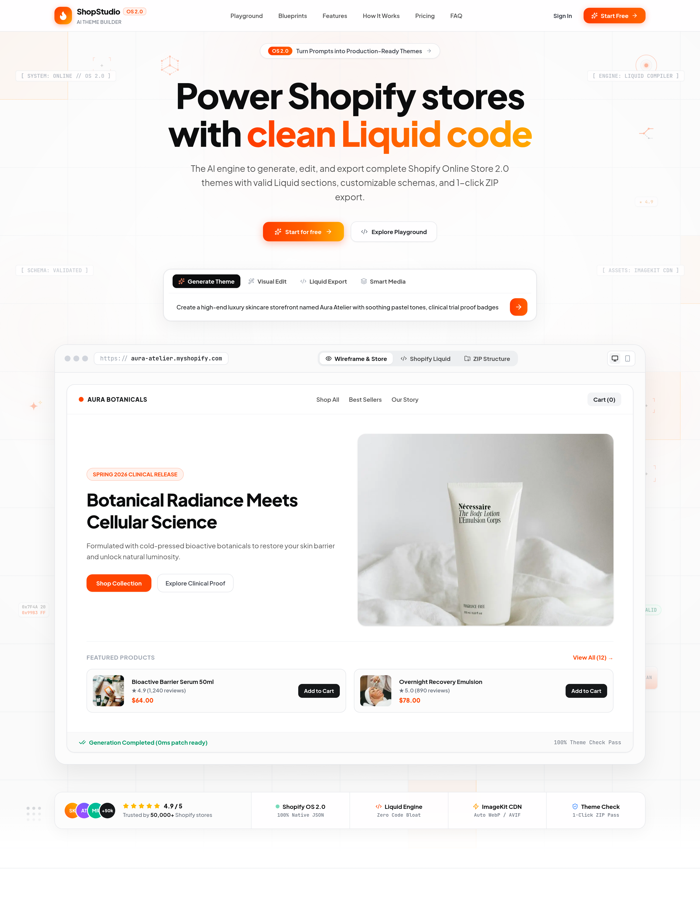

<div align="center">



# ShopStudio ⚡

**The AI-Powered Shopify Online Store 2.0 Theme Builder & SaaS**

*Transform natural language prompts into production-ready, fully responsive Shopify themes in seconds.*

[](https://nextjs.org/)
[](https://react.dev/)
[](https://tailwindcss.com/)
[](https://bun.sh/)
[](https://shopify.dev/)
[](https://insforge.dev)
[](./LICENSE)

---

</div>

## 📖 Overview

**ShopStudio** is a SaaS platform that bridges the gap between AI generation and actual e-commerce engineering. Unlike generic web generators that produce static HTML, ShopStudio generates **native Shopify Online Store 2.0** architecture:

- Liquid sections with modular `` definitions.
- Dynamic blocks, presets, and theme settings.
- JSON templates (`index.json`, `product.json`, `collection.json`, `cart.json`).
- Downloadable theme ZIP archives that can be uploaded directly to **Shopify Admin** without extra build steps or compilation.

---

## ✨ Key Features

### 🚀 1. Prompt-to-Storefront Generation
- Enter a brand description, niche, or vibe (e.g. *“Minimalist Japanese Ceramic Studio”*).
- AI structures the project brief, color palette, typography tokens, and section hierarchy.
- Real-time page generation across **Home**, **Product**, **Collection**, **Cart**, and **Custom** pages.

### 🤖 2. Multi-Model AI Engine (Provider-Independent)
- **Select AI Model Anytime**: Switch models on the **Dashboard**, **Projects directory**, or directly in the **Editor**.
- **Supported Providers & Models**:
  - **Google Gemini**: `gemini-2.5-pro`, `gemini-2.5-flash`, `gemini-2.0-flash`.
  - **DeepSeek**: `deepseek-chat` (V3), `deepseek-reasoner` (R1), `DeepSeek-V4-Flash-0731`.
  - **OpenRouter**: Access Claude 3.7 Sonnet, DeepSeek R1, Llama 3.3, and 200+ models.
  - **OpenAI**: `gpt-4.5-preview`, `gpt-4o`, `gpt-4o-mini`, `o3-mini`.
  - **Custom Endpoints**: Connect any OpenAI-compatible API (Ollama, vLLM, LocalAI, Groq).
- **In-Browser Model Settings**: Users can provide their own custom API keys and custom base URLs securely stored in local storage.

### 👁️ 3. Live Sandboxed Visual Preview
- Interactive, responsive preview with **Desktop**, **Tablet**, and **Mobile** viewports.
- Isolated preview rendering ensuring high security and accurate CSS isolation.

### ✏️ 4. Scoped Inline & AI Editing
- **Click-to-Select**: Click any section or element to inspect and edit.
- **AI Chat Refinement**: Request pinpoint adjustments (e.g. *"Change hero button to pill shape and make heading bolder"*).
- **Atomic Revisions**: Every edit creates a reversible revision with full undo/redo history.

### 🛍️ 5. Native Shopify Online Store 2.0 Compliance
- Converts Tailwind and HTML designs into valid Liquid code.
- Generates editable settings (color pickers, text fields, image pickers, range sliders).
- Integrates repeatable block structures for feature grids, testimonials, and collection cards.

### 📦 6. 1-Click ZIP Theme Export
- Validates JSON schemas, Liquid syntax, and asset references.
- Packages everything into a standard Shopify theme directory structure.
- Download the ZIP or save it to InsForge storage for team sharing.

### 🗂️ 7. Full Storefront Lifecycle & Project Management
- Search, preview, open, and permanently delete projects with cascade cleanup.
- Real-time project quotas and plan limits with seamless upgrade modals.

### 🖼️ 8. Zero-Config Media & ImageKit Pipeline
- Instant zero-config curated photography from verified Unsplash collections with automatic CORS resilience.
- Optional **ImageKit** text-to-image (`ik-genimg`) and AI image transformations (background removal, upscaling, retouching).

### 💳 9. Flexible Monetization & Dev Pro Bypass
- Built-in **Stripe** subscription tiers (Starter, Pro, Agency) with customer billing portal.
- **Dev Pro Bypass**: CLI tool (`bun run make-pro <email>`) and `NEXT_PUBLIC_ENABLE_FREE_PRO=true` flag to unlock Pro features without Stripe.

---

## 🛠️ Tech Stack

| Layer | Technology |
|---|---|
| **Framework** | Next.js 16 (App Router, Turbopack, Server Components) |
| **Frontend** | React 19, TypeScript (Strict Mode), Lucide Icons |
| **Styling** | Tailwind CSS v4, `@tailwindcss/postcss` |
| **Runtime & PM** | **Bun** (`bun dev`, `bun install`, `bun build`) |
| **AI Providers** | Multi-Provider Engine (Gemini, DeepSeek, OpenRouter, OpenAI, Custom) |
| **Backend & DB** | InsForge (PostgreSQL, Auth, Row-Level Security, File Storage) |
| **Media & CDN** | ImageKit & Curated Unsplash CDN Pipeline |
| **Payments** | Stripe (Checkout, Customer Portal, Webhooks) & Local CLI Upgrade |
| **Validation** | Zod Schema Validation |

---

## 📂 Project Structure

```text
├── app/
│   ├── (app)/                  # Protected application pages
│   │   ├── dashboard/          # Project overview, model picker & quick start
│   │   ├── projects/           # Project directory, search & deletion
│   │   ├── billing/            # Plans, subscription & usage
│   │   └── design-system/      # UI tokens & component showcase
│   ├── (auth)/                 # Authentication flows
│   │   ├── sign-in/            # User login
│   │   └── sign-up/            # Account registration
│   ├── api/                    # Server-side route handlers
│   │   ├── ai/                 # Multi-model streaming generation & inline edits
│   │   ├── billing/            # Stripe checkout, portal, webhook
│   │   ├── projects/           # Project CRUD & persistence
│   │   └── shopify/sections/   # Liquid conversion & export APIs
│   ├── editor/[projectId]/     # Main interactive theme builder & preview
│   ├── layout.tsx              # Root layout & providers
│   └── page.tsx                # High-converting landing page
├── components/
│   ├── billing/                # Subscription cards & upgrade modals
│   ├── editor/                 # Builder canvas, iframe preview, model picker, toolbar, chat
│   ├── landing/                # Landing page sections (Hero, FAQ, Showcase)
│   ├── projects/               # Project management & delete confirmation dialogs
│   └── ui/                     # Reusable design tokens and UI controls
├── lib/
│   ├── ai/                     # Multi-provider adapters (OpenAI-compatible, Gemini), models catalog
│   ├── billing/                # Subscriptions, entitlements & Pro overrides
│   ├── export/                 # HTML/CSS and PNG screenshot bundlers
│   ├── images/                 # ImageKit & curated Unsplash photography pipeline
│   ├── insforge/               # InsForge database client & repositories
│   └── shopify/                # Liquid converters, theme bundler, ZIP generator
├── migrations/                 # PostgreSQL database schemas & RLS policies
├── scripts/                    # CLI utilities (e.g. set-pro-user.ts)
└── docs/                       # Detailed setup & architectural guides
```

---

## 🚀 Quick Start

### 1. Prerequisites
- **Bun** (v1.0 or newer) — [Install Bun](https://bun.sh/)
- **InsForge Project** — [InsForge Dashboard](https://insforge.dev)
- **AI API Key** (at least one: Google Gemini, DeepSeek, OpenRouter, or OpenAI)
- *(Optional)* **ImageKit Account** & **Stripe Account**

### 2. Clone and Install

```bash
git clone git@github.com:amirfaisalz/shop-studio.git
cd shop-studio
bun install
```

### 3. Configure Environment Variables

Create `.env.local` from the example template:

```bash
cp .env.example .env.local
```

Fill in the environment keys:

```env
# InsForge Backend (Required)
NEXT_PUBLIC_INSFORGE_URL=https://your-project.insforge.app
NEXT_PUBLIC_INSFORGE_ANON_KEY=your-publishable-anon-key
INSFORGE_SERVICE_ROLE_KEY=your-service-role-admin-key

# AI Provider Keys (Configure at least one, or enter via UI)
GEMINI_API_KEY=your-gemini-api-key
DEEPSEEK_API_KEY=your-deepseek-api-key
OPENROUTER_API_KEY=your-openrouter-api-key
OPENAI_API_KEY=your-openai-api-key

# App URL
NEXT_PUBLIC_APP_URL=http://localhost:3231

# Developer Pro Mode (Optional: grant Pro features without Stripe)
NEXT_PUBLIC_ENABLE_FREE_PRO=true

# ImageKit (Optional: falls back to high-res Unsplash automatically)
NEXT_PUBLIC_IMAGEKIT_URL_ENDPOINT=https://ik.imagekit.io/your_id

# Stripe Billing (Optional for live payments)
STRIPE_SECRET_KEY=sk_test_...
STRIPE_WEBHOOK_SECRET=whsec_...
```

### 4. Database Setup & Migrations

Import the database schema and RLS policies into your InsForge project:

```bash
bun run db:migrate
```

*For manual setup via the SQL Editor, execute [`migrations/schema.sql`](./migrations/schema.sql).*

### 5. Upgrade User to Pro (Optional / Dev)

To grant Pro plan entitlements directly in your database:

```bash
# Upgrade by email:
bun run make-pro your-email@example.com

# Or upgrade all existing users:
bun run make-pro all
```

### 6. Run Local Development Server

```bash
bun run dev
```

Open [http://localhost:3231](http://localhost:3231) in your browser.

---

## ⌨️ Useful Commands

```bash
# Start development server on port 3231
bun run dev

# Run static typecheck & ESLint
bun run lint

# Upgrade a user account to Pro (Yearly) directly in database
bun run make-pro <user_email_or_uuid>

# Build production bundle
bun run build

# Start production server
bun run start

# Run database migrations
bun run db:migrate
```

---

## 📚 Documentation & Guides

For deeper implementation details, refer to:
- 📖 [Project Setup Guide](./projectsetup.md)
- 💳 [Billing & Stripe Configuration](./docs/billing-setup.md)
- 🛍️ [Shopify Export & Bucket Setup](./docs/shopify-export-setup.md)
- 🖼️ [Project Thumbnails Setup](./docs/projects-thumbnails-setup.md)
- 🤖 [Engineering & Agent Rules](./AGENTS.md)

---

## 📄 License

This project is licensed under the [MIT License](./LICENSE).
